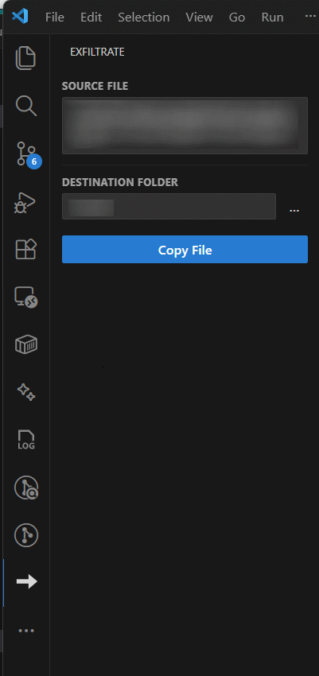

# Exfiltrate

**Copy the currently open file from a remote VS Code session to your local filesystem — with one click.**

Exfiltrate is a VS Code extension that makes it effortless to save files from any remote environment to your local machine. Whether you're working in GitHub Codespaces, WSL, Dev Containers, or over SSH, Exfiltrate provides a simple sidebar panel where you can pick a local destination folder and copy the active file — no terminal required.

## ✨ Features

- **📄 One-Click Copy** - Copy the active editor file to your local machine with a single button press
- **🗂️ Folder Picker** - Browse for a destination folder on your *local* filesystem, even when connected to a remote
- **🔔 Overwrite Protection** - Prompts before overwriting an existing file at the destination
- **🌐 Works Everywhere** - Supports local workspaces, GitHub Codespaces, WSL, Dev Containers, and SSH remotes
- **🎯 Sidebar UI** - Intuitive panel in the Activity Bar showing the active source file at a glance
- **💾 Persistent Destination** - Remembers your last-used destination folder across sessions

## 🖼️ Screenshots



_The Exfiltrate panel showing the source file and destination folder, ready to copy._

## 🚀 Quick Start

1. **Install the extension** in VS Code
2. **Open the Exfiltrate panel** - Click the download icon in the Activity Bar (left sidebar)
3. **Open a file** in the editor — its path appears in the **Source File** row
4. **Set a destination folder** - Type a path or click `…` to browse your local filesystem
5. **Click "Copy File"** - A toast notification confirms the copy

## 📖 Usage

### Copying a File

1. Open any file in the VS Code editor
2. Open the Exfiltrate panel from the Activity Bar
3. Verify the **Source File** path is correct
4. Enter or browse for a **Destination Folder** on your local machine
5. Click **Copy File**

If a file with the same name already exists at the destination, Exfiltrate will ask before overwriting it.

### Browsing for a Destination

- Click the `…` button next to the destination field to open a native folder picker
- The picker always targets your **local** filesystem, even when the editor is connected to a remote

### Command Palette

You can also use the command palette (`Ctrl+Shift+P`):

- `Exfiltrate: Copy Current File to Local`
- `Exfiltrate: Open Panel`
- `Exfiltrate: Show Logs`

## ⚙️ Configuration

Configure the extension in VS Code settings (`Ctrl+,` → search *Exfiltrate*):

### `exfiltrate.destinationPath`

- **Description**: Local folder on the host machine to copy files into
- **Default**: `` (empty - must be configured)
- **Windows Example**: `C:\Users\YourName\Downloads`
- **Mac/Linux Example**: `/Users/YourName/Downloads`

## 🔧 Requirements

- VS Code 1.85.0 or higher
- Read access to the source file in your development environment
- Write access to the destination path on your local machine

## 🌐 Supported Environments

- **Local Development** - Works with any locally open file
- **GitHub Codespaces** - Copy files from Codespaces directly to your local machine
- **WSL** - Full support for Windows Subsystem for Linux
- **Dev Containers** - Works inside development containers
- **SSH Remote** - Works when connected to remote machines via SSH

## 🎯 Use Cases

- **Grab a Config File**: Pull a generated or modified config from a remote environment to your local machine
- **Save Build Artifacts**: Copy compiled outputs or logs off a remote before closing the session
- **Quick Backup**: Snapshot an important file locally without leaving VS Code
- **Share a File**: Copy a file to a local sync folder (Dropbox, OneDrive) for easy sharing
- **Cross-Environment Transfer**: Move a file from one remote environment to local, then open it elsewhere

## 🛠️ How It Works

1. **Environment Detection**: Automatically detects your environment (local, Codespace, WSL, Dev Container, SSH)
2. **Source Read**: Reads the active editor's file using `vscode.workspace.fs`, which works transparently across all remote extension hosts
3. **Smart Write**: Writes to the local filesystem using:
   - `vscode.Uri.file()` for local and WSL sessions
   - The `vscode-local:` URI scheme for true remote contexts (SSH, Codespaces, Dev Containers), which instructs VS Code to write the file on the UI (local) host
4. **Overwrite Check**: If the destination file already exists, prompts before replacing it

## 🐛 Troubleshooting

### "No file is currently open"

- Open a file in the VS Code editor — Exfiltrate copies the file in the **active editor tab**
- Make sure the editor tab is focused, not a panel or terminal

### "Please configure the destination path"

- Set `exfiltrate.destinationPath` to a valid local path, or use the `…` browse button in the panel
- For remote environments (Codespaces, SSH), this must be a path on your **local** machine
- Make sure the path exists or that you have permission to create it

### Destination folder picker shows remote filesystem

- This can happen if the extension is running entirely in the workspace (remote) host
- Check that `extensionKind` is set to `["ui", "workspace"]` — this is the default for Exfiltrate and ensures the UI component runs locally

## 📝 Development

```bash
npm install
npm run compile        # one-shot build
npm run watch          # incremental build
```

Press **F5** in VS Code to launch an Extension Development Host.

## 📄 License

MIT License - see [LICENSE](LICENSE) file for details

## 🤝 Contributing

Contributions are welcome! Please feel free to submit issues or pull requests.

## 📬 Feedback

Have suggestions or found a bug? Please [open an issue](https://github.com/supermem613/exfiltrate/issues) on GitHub.
